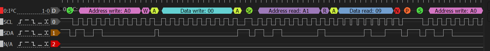
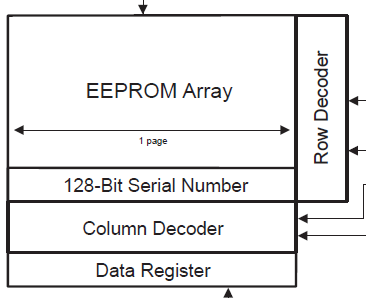
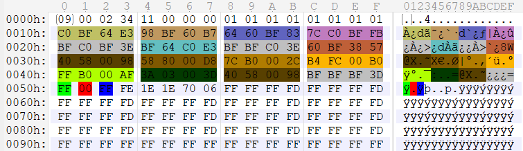

# Reversing Pixmob IR LEB Wristband

## Overview

While numerous repositories have explored and successfully reverse-engineered various aspects of the Pixmob IR LEB wristband, I have opted to delve into the EEPROM myself. This personal investigation aims to broaden the existing knowledge base about the device's functionality.


### MCU

There seems a few different variants of these in the wild.
I've come across one that has nothing written on it which I suspect is an ABOV model. I did discover one model that hasn't been seen before that has markings.

[Data Sheet](docs/NY8A054E.pdf) for that one is here.


### EEPROM
The [/dumps](dumps/) directory contains what I've extracted from the SMD eeprom labeled **C24C02** and **AK16H** from a few wristbands.

My soldering skills are pretty shit however I managed to connect some wires to it. After using the [Bus Pirate 5](https://hardware.buspirate.com/) I successfully dumped the contents.


I got my hands on another few samples to mess with shortly after. These I connected proper probes to and also dumped it's contents which appears to be the same.


[Data Sheet](docs/AT24C02.pdf)

The address we interface with the EEPROM is:

* `0x50`
    * (0xA0) **WRITE**
    * (0xA1) **READ**

#### Behaviour

When the PixMob is provided power the MCU appears to wipe the EEPROM and write a default state to it if certain criteria isn't met.

This was discovered using a logic analyzer attached to the PCB while observing the boot up sequence when power was supplied to the Pixmob bracelet.


```hex
09 00 00 01 00 00 00 00 01 01 01 01 01 01 01 01
00 BF 00 BF 00 BF 60 1F 00 60 BF 1F 00 00 BF BF
BF 00 BF 7E BF 00 00 BF BF BF 00 7E 60 BF 00 1F
00 00 00 00 00 00 00 00 00 00 00 00 00 00 00 00
00 00 00 00 00 00 00 00 00 00 00 00 00 00 00 BF
BF BF 3D 00 00 00 1E 1E 1E 70 06 FF FF FF FF FF
```

The startup procedure goes something like this:

##### Default startup
1. A read is performed at `0x00` = [0x09]
2. A read is performed at `0x03` = [0x01]
3. A read is performed at `0x02` = [0x00]
4. A read is performed at `0x01` = [0x00]
5. A read is performed at `0x08` = [0x01]
6. A read is performed at `0x04` = [0x01] (Read the mode)

##### EEPROM startup

1. Address `0x00` is set for read, and data `0x09` is read back.
2. Address `0x03` is set for read, and data `0x04` is read back.
3. Address `0x02` is set for read, and data `0x02` is read back.
4. Address `0x01` is set for read, and data `0x00` is read back.
5. Address `0x08` is set for read, and data `0x01` is read back.
6. Address `0x04` is set for read, and data `0x11` is read back.

***0x11*** **means EEPROM_MODE** so it will read starting from `0x50`

7. Address `0x50` is set for read, and data `0x00` is read back.
    * **eeprom_mem_config->COLOR GREEN**
8. Address `0x51` is set for read, and data `0x00` is read back.
    * **eeprom_mem_config->COLOR RED**
9. Address `0x52` is set for read, and data `0x00` is read back.
    * **eeprom_mem_config->COLOR BLUE**
10. Address `0x53` is set for read, and data `0x1F` is read back.
    * **eeprom_mem_config->Attack intensity**
11. Address `0x54` is set for read, and data `0x1E` is read back.
    * **eeprom_mem_config->Hold timer**
12. Address `0x55` is set for read, and data `0x1E` is read back.
    * **eeprom_mem_config->Release timer**
13. Address `0x56` is set for read, and data `0x70` is read back.
    * **eeprom_mem_config->cfg_profile_range**
14. Address `0x57` is set for read, and data `0x06` is read back.
    * **eeprom_mem_config->cfg_mode_selector**
15. Address `0x14` is set for read, and data `0x98` is read back.
    * **mem_a->color2->green**
16. Address `0x15` is set for read, and data `0xC0` is read back.
    * **mem_a->color2->red**
17. Address `0x16` is set for read, and data `0x30` is read back.
    * **mem_a->color2->blue**
18. Address `0x17` is set for read, and data `0x88` is read back.
    * **mem_a->color2->checksum**


I've intensionally left out the rest of the data as it's mostly **FF**. However, pointed out to me by [@sammy](https://github.com/samyk) there appears to be some data in the last 8 bytes of the 256 block when the eeprom is powered and active. These are (my guess) something to do with the data registers ***See the diagram below***.



#### Memory structure

You can find my research for the structure in [/scripts/010Editor/PIXMOB_EEPROM_flash2.bt](scripts/010Editor/PIXMOB_EEPROM_flash2.bt)
template which works for [010Editor](https://www.sweetscape.com/010editor/).


You can also apply the script [/scripts/010Editor/PIXMOB_VISAULIZE_COLORS.1sc](scripts/010Editor/PIXMOB_VISAULIZE_COLORS.1sc)
which will show you the current colors in memory:



#### Bracelet Config - Memory Mode

When address `0x04` is set to **MEM_MODE** `0x11` the bracelet will play back the data set in the EEPROM. 

`eeprom_mem_config->cfg_profile_range` Bits [7:4] select the high end of the profile index and bits [3:0] selects the low end of the profile index.

`eeprom_mem_config->cfg_mode_selector` is some kind of mode selector.

##### Static mode
`0x00`, `0x01`, `0x04`, `0x05`, `0x08`, `0x09`, `0x0C`, or `0x0D`: Pulses the RGB values in memory `0x50-0x52`. Last I2C read is for `0x57` during startup, no further I2C reads seen.

##### Sequential mode
`0x02`, `0x03`, `0x0A`, or `0x0B`: Sequential mode. Starts with profile index `eeprom_mem_config->cfg_profile_range[3:0]` and sequentially counts up to `eeprom_mem_config->cfg_profile_range[7:4]`, then rolls over. I2C read of profile data at the start of every pulse.

##### Random mode
0x06, 0x07, 0x0E, or 0x0F: Random profile index between `eeprom_mem_config->cfg_profile_range[3:0]` and `eeprom_mem_config->cfg_profile_range[7:4]`. I2C read profile data at the start of every pulse.


### Support, Contribute & Thanks

If you are interested in this work there is a [Discord server](https://discord.gg/UYqTjC7xp3) someone has setup, feel free to join or contact me.

Thanks to [@jamesw343](https://github.com/jamesw343) for the research in regards to the profile/mode selector findings in memory mode.


---

## Other projects

1. [PixMob IR (and RF!) Reverse Engineering Project](https://github.com/danielweidman/pixmob-ir-reverse-engineering)
2. [PixMob_waveband reverse engineering](https://github.com/sueppchen/PixMob_waveband/tree/main)
3. [ndp2019-wristband-teardown](https://github.com/yeokm1/ndp2019-wristband-teardown)
