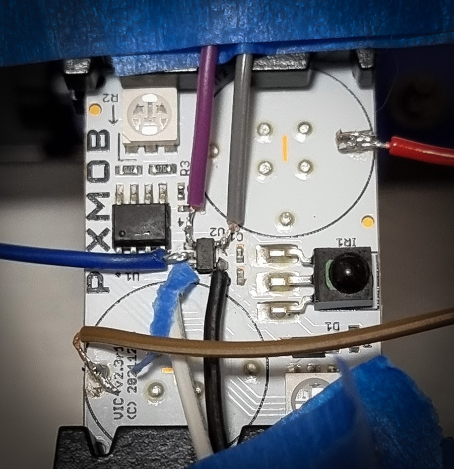

# Reversing Pixmob IR LEB Wristband

## Overview

While numerous repositories have explored and successfully reverse-engineered various aspects of the Pixmob IR LEB wristband, I have opted to delve into the EEPROM myself. This personal investigation aims to broaden the existing knowledge base about the device's functionality.


### MCU

There seems a few different variants of these in the wild.
I've come across one that has nothing written on it which I suspect is an ABOV model. I did discover one model that hasn't been seen before that has markings.

[Data Sheet](docs/NY8A054E.pdf) for that one is here.


### EEPROM
The [/dumps](dumps/) directory contains what I've extracted from the SMD eeprom labeled **C24C02** from a few wristbands.

My soldering skills are pretty shit however I managed to connect some wires to it. After using the [Bus Pirate 5](https://hardware.buspirate.com/) I successfully dumped the contents.



I got my hands on another few samples to mess with shortly after. These I connected proper probes to and also dumped it's contents which appears to be the same.


[Data Sheet](docs/AT24C02.pdf)

#### Behaviour

When the PixMob is provided power the MCU appears to wipe the EEPROM and write a default state to it.

```hex
09 00 00 01 00 00 00 00 01 01 01 01 01 01 01 01
00 BF 00 BF 00 BF 60 1F 00 60 BF 1F 00 00 BF BF
BF 00 BF 7E BF 00 00 BF BF BF 00 7E 60 BF 00 1F
00 00 00 00 00 00 00 00 00 00 00 00 00 00 00 00
00 00 00 00 00 00 00 00 00 00 00 00 00 00 00 BF
BF BF 3D 00 00 00 1E 1E 1E 70 06 FF FF FF FF FF
```

I've intensionally left out the rest of the data as it's mostly **FF**. However pointed out to me by [@sammy](https://github.com/samyk) there appears to be some data in the last 8 bytes of the 256 bytes.

#### Memory structure

You can find my research for the structure in [/scripts/PIXMOB_EEPROM_flash2.bt](scripts/PIXMOB_EEPROM_flash2.bt)
which works for [010Editor](https://www.sweetscape.com/010editor/).


### Future Work

TO FILL OUT

## Other projects

1. [PixMob IR (and RF!) Reverse Engineering Project](https://github.com/danielweidman/pixmob-ir-reverse-engineering)
2. [PixMob_waveband reverse engineering](https://github.com/sueppchen/PixMob_waveband/tree/main)
3. [ndp2019-wristband-teardown](https://github.com/yeokm1/ndp2019-wristband-teardown)